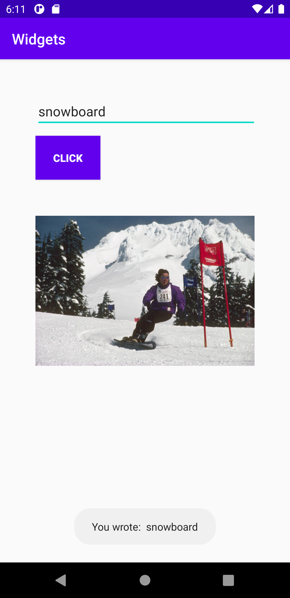

# Rapport för uppg. 3: Widgets

Till en början lades en LinearLayout till i activity_main.xml genom koden nedan. Taggarna <LinearLayout> definierar layouten och koden inom öppningstaggen positionerar de _widgets_ som ligger innanför. I efterhand lades ytterligare LinearLayout:s till för att ändra _layouten_ än mer.

```
<LinearLayout
    xmlns:android="http://schemas.android.com/apk/res/android"
    xmlns:app="http://schemas.android.com/apk/res-auto"
    xmlns:tools="http://schemas.android.com/tools"
    android:layout_width="match_parent"
    android:layout_height="match_parent"
    android:orientation="vertical"
    tools:context=".MainActivity">

        <EditText
            .../>

        <Button
            .../>

        <ImageView
            ... />
</LinearLayout>
```

Nästa steg var att lägga till de widgets som syns i kodrutan ovan, dvs. EditText, Button och ImageView. Dessa tre lades till med var sina självstängande taggar innehållande de respektive elementens styling, id och ev. källa.


Sambandet mellan widgeten Button och EditText skapades genom koden nedan och gör så att den text användaren skrivit in sedan visas i en tillfällig ruta (se bild nedan). För att faktiskt kunna använda de olika _widget:sen_ som lagts till var en tvungen att lägga till olika _imports_.
```
import android.widget.EditText;
import android.widget.Button;

import android.widget.Toast;
import android.view.View;
```
De två sista _importsen_ var nödvändiga för att få funktionaliteten av koden nedan. `<MyButton>` och `<editText>` definierades innan kodblocket ovan.

```
MyButton = (Button) findViewById(R.id.id_button);//get id of button
MyButton.setOnClickListener(new View.OnClickListener() {
    @Override
    public void onClick(View view) {
        if (editText.getText().toString().isEmpty()) {
            Toast.makeText(getApplicationContext(), "Enter the Data", Toast.LENGTH_SHORT).show();
        }
        else{
            Toast.makeText(getApplicationContext(), "You wrote:  " + editText.getText().toString(), Toast.LENGTH_SHORT).show();
        }
    }
});
```

Koden ovan säger att om användaren inte skrivit in något så ska texten "Enter the Data" visas medan det är användarens egna text som ska visas om hen skrivit in något i textfältet.Detta görs med hjälp av en funktion som håller en if-sats.

